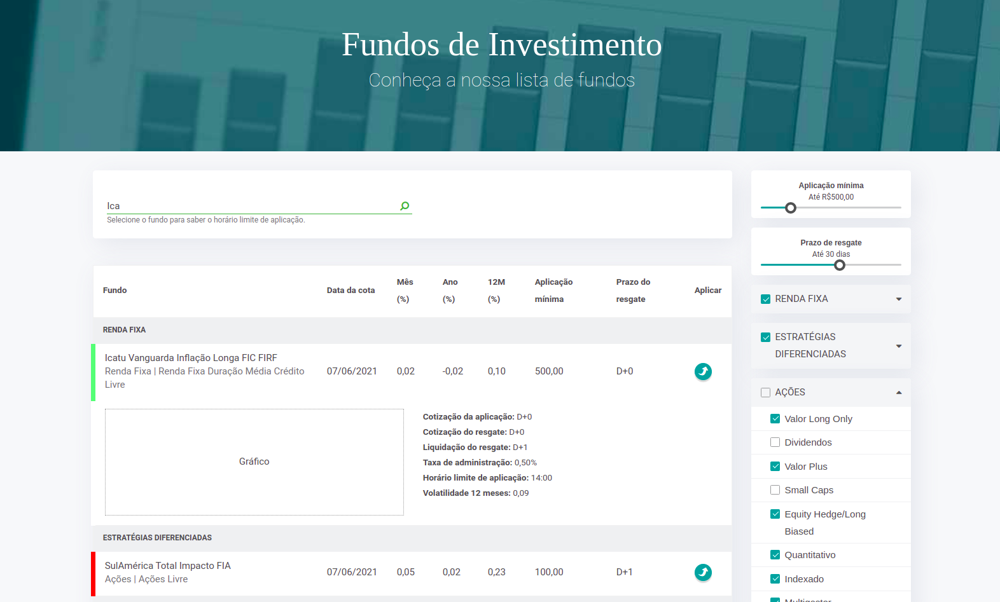

# Invest Plus

## What's it?
This is a financial app project to list and to filter real investment funds. This was built with AgularJS and Foundation 6.

## Main concepts:
Services, directives, filters, contexts and components.

## Sample view:

## Requirements:
1. `node 8.16.0 or >`
2. `npm 6.4.1`
3. `gulp 3.9.1`

## Running the project (locally):

1. `cd invest-plus`
2. `npm i`
3. `npm run dev`
